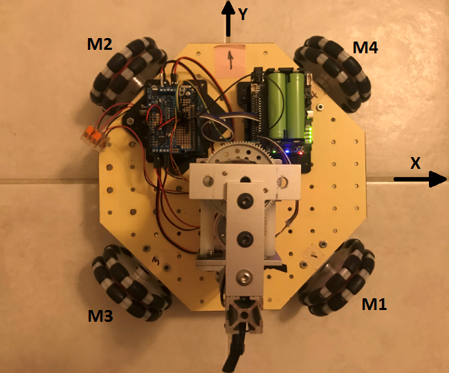

## OMNI-WHEEL CAR

### Top view of Omni Wheel car showing wheel/motors and directional conventions

This configuration of omni-wheels is easily controlled to move in any direction: X, Y, θz:
- forward-back motion (along the Y axis)
- right-left sideways motion (along the X axis)
- spin motion (θz).

Moreover, all three of these motions can be superimposed. The motors can be commanded to combine these motions simultaneously. (More about that later) For now, let's just consider how we can get the car to move in one DOF at a time.

If we were to drive the car along a 45 degree direction into the first quadrant (along the common axis of wheel motors M3 and M4), wheel motor **M1** would need to be driven **clocwise** and wheel motor **M2** would need to be driven **CCW** at the same speed. Wheel motors M3 and M4 would not run. 

For somewhat arbitrary reasons, it has been chosen to designate the **Y** direction as the car's **forward direction**. (The LiDAR is mounted so that it scans a 180 degree sector from left to right.)

To drive the car forward (in the **Y** direction) all four wheel motors would run at the same speed but M1 and M4 would run **CW** while M2 and M3 would run **CCW**.

To get the car to spin **CCW** about its own axis (θz), all four wheel motors would run **CW** at the same speed.