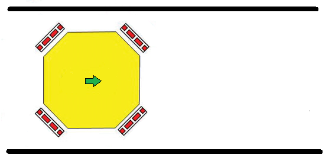
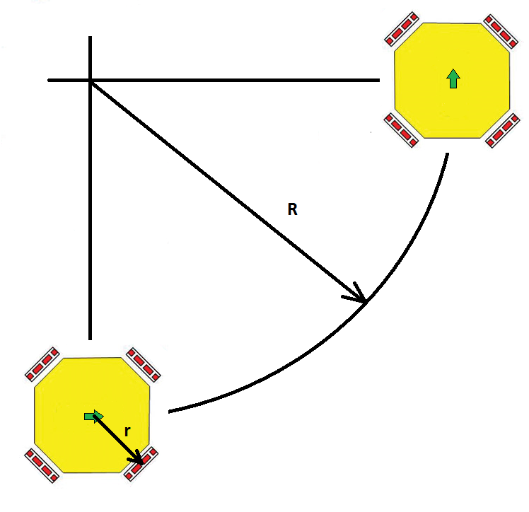

## OMNI-WHEEL CAR


### Top view of Omni Wheel car showing wheel/motors and directional conventions

This configuration of omni-wheels is easily controlled to move in any direction: X, Y, θz:
- forward-back motion (along the Y axis)
- right-left sideways motion (along the X axis)
- spin motion (θz).

Moreover, all three of these motions can be superimposed. The motors can be commanded to combine these motions simultaneously. (More about that later.) For now, let's just consider how we can get the car to move in one DOF at a time.

Imagine that we want to drive the car along a 45 degree direction into the first quadrant (along the common axis of wheel motors M3 and M4). Only wheel motors **M1 and M2** would run. **M1** would need to be driven **clockwise** and **M2** would need to be driven **CCW** at the same speed. Wheel motors M3 and M4 would not run. To drive drive the car at speed S along the 45 degree direction, we would send the following drive values to the motors:

```
m1 = +S
m2 = -S
m3 = 0
m4 = 0
```

Now imagine that we want to drive the car along a 135 degree direction into the second quadrant (along the common axis of wheel motors M1 and M2). Only wheel motors **M3 and M4** would run. **M4** would need to be driven **clockwise** and **M3** would need to be driven **CCW** at the same speed. Wheel motors M1 and M2 would not run. To drive drive the car at speed S along the 135 degree direction, we would send the following drive values to the motors:

```
m1 = 0
m2 = 0
m3 = -S
m4 = +S
```

Notice that the car's motion along the 45 degree direction is completely **independent** from its motion along the **orthogonal** 135 degree direction. First, it suggests that the "natural coordinate system" for the omni-wheels runs through the wheel axes (which happens to be oblique to the car's coordinate system). But it also invites us to realize that we may combine the control of these two **independent degrees of freedom** in any combination we desire. Thus, it seems reasonable to consider driving the car in any arbitrary angular direction. The mathematics of this is simplified by using **polar coordinates (r, θ)** to specify the speed and direction of the car. To convert between the omni-wheels 'natural' coordinates and the car's coordinates, we simply add or subtract 45 degrees (pi/4) from the theta value. Below is the algorithm to drive the car in a direction theta at speed.

```
speed, theta = desired_speed_and_direction
theta += pi/4
u, v = convert_polar_to_rect(speed, theta)
m1 = u
m2 = -u
m3 = -v
m4 = v
```
Notice the rectangular coordinates in the omni-wheel's natural coordinate system have been labeled u, v. This is intended to remind us that they are not the same as x, y coordinates in the car's coordinate system.
If we want to simultaneously spin the car **CCW** about its own Z axis, all four wheel motors would receive an additional **CW** component as shown below.
```
spin = some_value
speed, theta  = desired_speed_and_direction
theta += pi/4
u, v = convert_polar_to_rect(speed, theta)
m1 = u + spin
m2 = -u + spin
m3 = -v + spin
m4 = v + spin
```

### Maintaining Cross-Track position within travel lane

Let's say we want our omni-wheel car to travel in the positve Y direction (FWD) and we want it to stay centered in its travel lane. Just like any car, it is neccesary to make subtle steering corrections in response to unintended cross-track deviations from its intended path. In the figure below, our car has been shown in a 'travel lane' traveling from left to right. 



This is where polar coordinates again come to the rescue. It's easy to make a subtle steering correction if we're already working in polar coordinates. Simply modulate the angle coordinate until the car's cross-track position error has been nulled. Done!
Below is shown the signature of the method to drive the car using polar coordinates. 
 

``` python
    def go(self, speed, angle, spin=0):
        """
		Drive at speed (int) in relative direction angle (degrees)
        while simultaneoulsy spinning CCW at rate = spin (int).
        """
```

### Making radius turns

What if the lane is curved? How do we make the car follow a curved path of radius = R as shown in the diagram below? That's what the spin parameter is for.



This diagram shows our car moving in the FWD direction while simultaneously spinning CCW, resulting in a path which is the arc of a circle of radius R. We need to come up with the correct value of spin which will produce 90 degrees of rotation as the car translates along 1/4 of the circumference of the circle.

Notice that the drive direction of the wheels is 45 degrees from the direction of travel of the car. As a result, the motion of the wheels at their interface with the floor must **exceed** the distance the car translates by a factor of √2.

> translation distance (at wheels) = (pi * R/2) * √2

Knowing the dimension r from the car's geometric center to each wheel, we can find the corresponding value of spin that will produce 90 degrees of CCW rotation of the car about its own axis is:

> spin distance (at wheels) = pi * r/2

In summary, the car will follow the curved path of radius R if the value of spin is proportional to the car speed in the following ratio:

> spin_ratio =  r/R * √2/2
